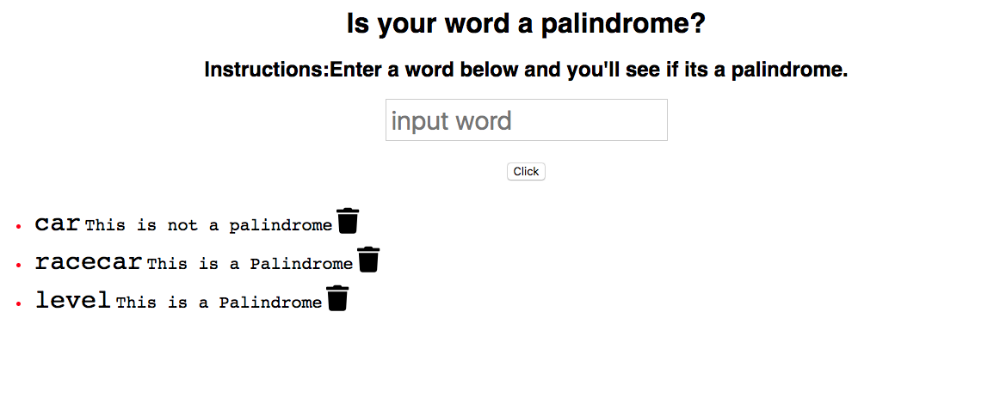

#Project: Palindrome checker using express
# Installation
1. Clone repo
2. run `npm install`

## Usage

1. run `npm run savage`
2. Navigate to `localhost:3000`

# How its made:

## Technologies: HTML/EJS, javascript, css, express,mongodb
#Server
## I made this web application utilizing the express framework. The Express server listens to user input stores the users input into mongodb. The users input is rendered to the dom and every entry shows the usersinput and if the input is a palindrome

